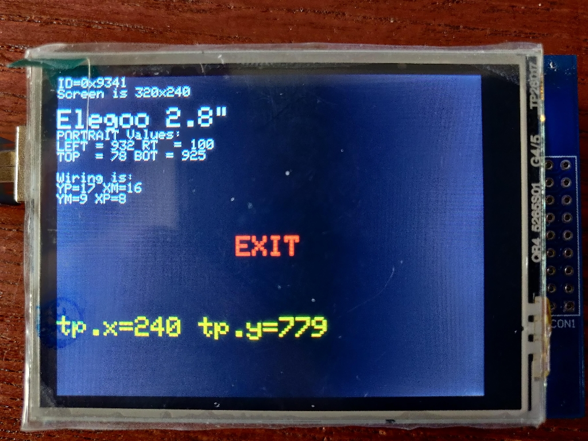
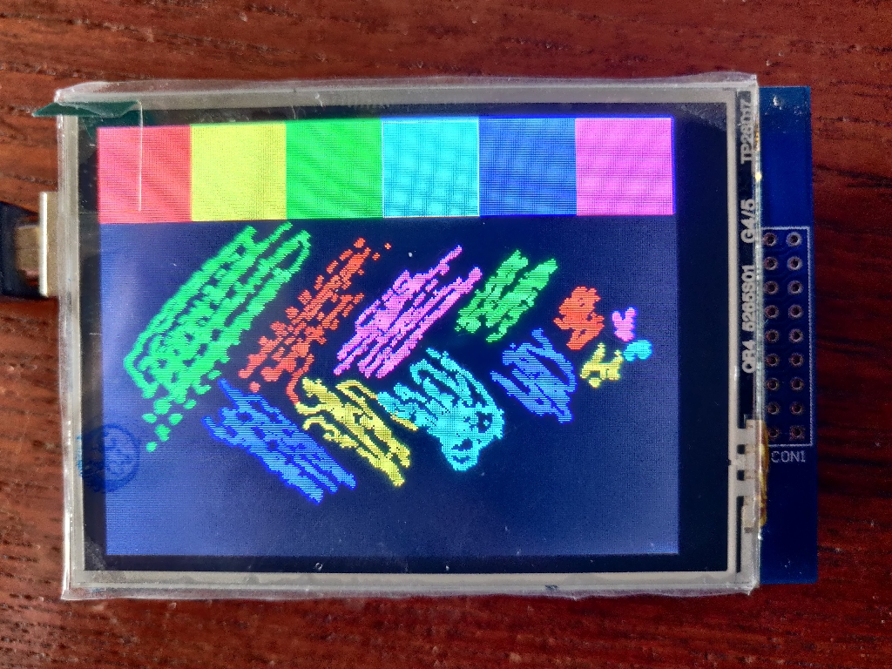
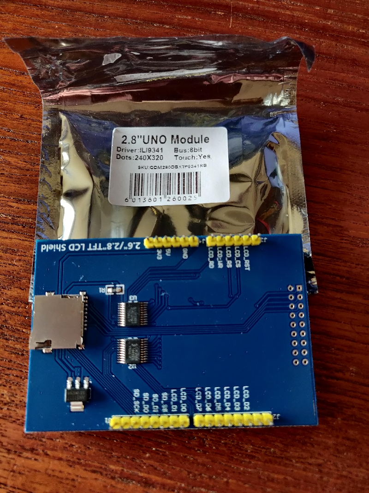

# Elegoo_ILI9341_touch

* 2.8 inch TFT display module for Arduino UNO

| Feature   | Note   |
|-----------|--------|
| Driver    | ILI9341|
| Resolution| 320x240|
| Touch     | SPI    |
| Display   | 8 bit  |

# sample display

[Video](https://youtu.be/kLCoMVaV1Vo)

# Demo software

Libraries used by sketches:

[Library archives](./libraries)

Sketches

[TouchTest](./TouchTest/TouchTest.ino)

[Touch_Shield_new](./Touch_Shield_new/Touch_Shield_new.ino)

